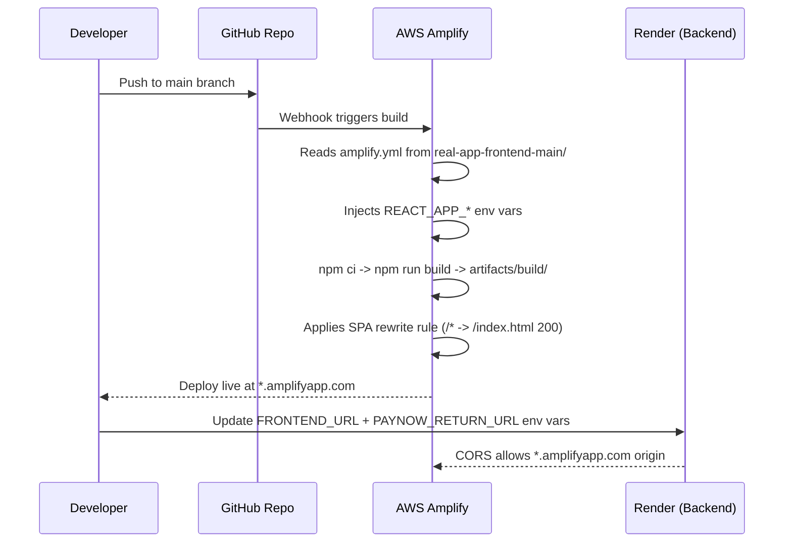

# Creapy

## Deployment

1. Connect the `real-app-frontend-main` subdirectory to AWS Amplify. In Amplify monorepo settings, set **App root** to `real-app-frontend-main`.
2. Add all required environment variables in Amplify from `real-app-frontend-main/AMPLIFY_ENV.md`.
3. Amplify reads `real-app-frontend-main/amplify.yml`; confirm the build output directory is `build`.
4. Keep the backend on Render and set `FRONTEND_URL` on Render to the deployed Amplify URL after first frontend deploy.
5. Set `PAYNOW_RETURN_URL` on Render to the deployed Amplify frontend URL.

